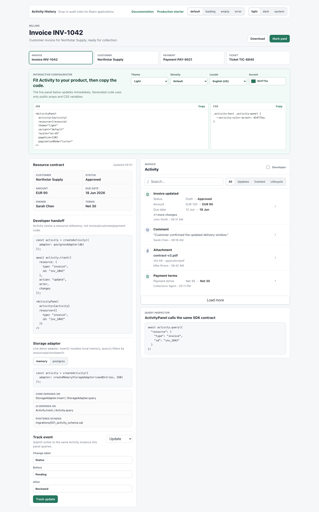

# Use cases and comparison

The [live demo](https://andreyshedko.github.io/activity/) uses the public component
API and lets evaluators change theme, density, locale and accent color before
copying the resulting integration code.

## Best fit

- invoice, customer, ticket, order and project detail pages;
- user-visible change history with comments and attachments;
- internal operations tools that need searchable actor/action history;
- products that must keep credentials and data in their own infrastructure.

## Not the same as

| Alternative | Optimized for | Difference from Activity |
|---|---|---|
| Application logs | debugging services | Logs are system-centric and usually not appropriate user-facing product history. |
| Database CDC | capturing row changes | CDC observes storage mutations; Activity records meaningful user operations and display context. |
| Analytics events | funnels and aggregate behavior | Analytics is not a durable per-resource history UI. |
| Compliance audit system | immutable evidence, retention and reporting | Activity is product history; legal-grade immutability/reporting requires additional controls. |
| Building in-house | complete bespoke control | Activity supplies the engine, adapters, accessible React UI and tested states that otherwise become ongoing maintenance. |

## Example resources

- Invoice: created, status changed, owner changed, comment added, attachment uploaded.
- Customer: profile updated, segment changed, merged, archived, restored.
- Ticket: assigned, priority changed, replied, escalated, closed.
- Order: placed, payment captured, fulfillment updated, refunded.

Activity deliberately avoids domain-specific invoice or ticket code. Stable
actions plus resource, actor, changes and content let the host application retain
its own domain model.

## Evaluation paths

| If you are building | Start with | Validate next |
|---|---|---|
| SaaS billing | Invoice resource in the live demo | tenant isolation and server-derived actors in the production starter |
| Support tooling | Ticket resource and content filter | comments, attachments, keyboard navigation and error recovery |
| Internal operations | Customer or payment resource | search, cursor pagination and PostgreSQL performance contract |
| Local-first or desktop software | memory quick start | SQLite adapter and custom attachment handling |

These are reproducible product scenarios, not customer endorsements. Public case
studies should only be added after a user has approved their name, result and logo.
